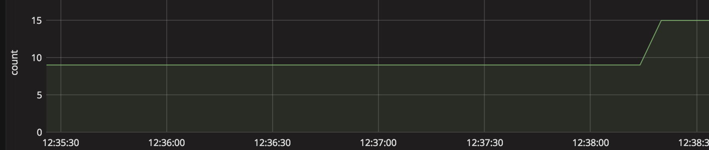

# Alerting workflow

## 1. Pre-requisities

To get setup open the following tabs in Google Chrome:

1. [Prometheus](http://prometheus.example.com/)
2. [Alerting Manager](http://alerting.example.com/)
3. [Grafana](http://grafana.example.com/)
4. [Fotia](http://fotia.example.com/)

## 2. Prometheus

From the Prometheus homepage enter `ecount` into the textbox and click `execute` you should see on the right hand side underneath the column Value, the value of 0.

## 3. Grafana

From the Grafana homepage click on the dashboard dropdown and select `Fotia dashboard`.

## 4. Increase ecount metric

Browse to the following URL: [http://fotia.example.com/up/5/](http://fotia.example.com/up/5/)

## 5. Refresh the Grafana dashboard

If you go back to the Fotia dashboard in Grafana you should see the following

## 6. Re-execute prometheus metric

From the Prometheus homepage enter `ecount` into the textbox and click `execute` you should now see the value 5 appearing.

## 7. Verify no alert has been fired to Slack

As our alert was configured to only fire when the value of `ecount` is greater than 5, we haven't received any alert yet.

## 8. Increase the ecount metric further

Browse to the following URL: [http://fotia.example.com/up/4/](http://fotia.example.com/up/4/)

## 9. Re-execute prometheus metric

From the Prometheus homepage enter `ecount` into the textbox and click `execute` you should now see the value 9 appearing.

## 10. Refresh the Grafana dashboard

If you go back to the Fotia dashboard in Grafana you should see the following

## 11. Check the #fotia-alerts channel in Slack

In slack you should now see the following alert:

## 12. Increase the ecount metric further

Browse to the following URL: [http://fotia.example.com/up/6/](http://fotia.example.com/up/6/)

## 13. Check the #fotia-alerts channel in Slack

In slack you should now see the following alert:

## 14. Check the alert manager UI

If you browse to the Alert Manager you should now see the alert

## 15. Refresh the Grafana dashboard

If you go back to the Fotia dashboard in Grafana you should see the following

## 16. Decreate the ecount metric back to zero

Browse to the following URL: [http://fotia.example.com/down/15/](http://fotia.example.com/up/15/)

## 17. Refresh the Grafana dashboard

If you go back to the Fotia dashboard in Grafana you should see the line go back down to zero

## 18. Check the alert manager UI

If you browse to the Alert Manager you should now see the alert has gone.